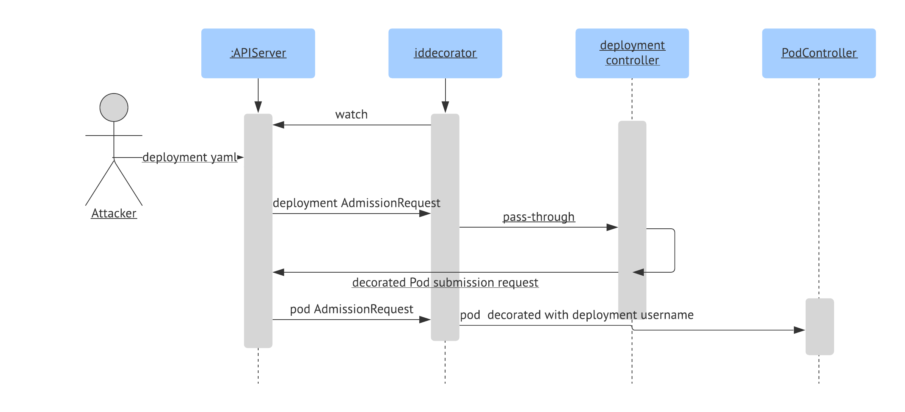

# Iddecorator

A mutating webhook admission controller that annotates authenticated userid.

## Configuration
The configuration of the deployed webhook is done via `MutatingWebhookConfiguration` and the `paths-to-decorate` Configmap.
The `MutatingWebhookConfiguration` has the following configuration: 
```yaml 
rules:
  - operations: [ "CREATE" ]
    apiGroups: ["*"]
    apiVersions: ["*"]
    resources: ["*"]
namespaceSelector:
  matchLabels:
    iddecorator: enabled
```
This means that the webhook watches all resource creation, on namespaces that have the label `iddecorator: enabled`

`paths-to-decorate` is a Configmap for the webhook application, and this is how that looks:
```yaml
  paths.yaml: |
    configs:
      alltypes:
        paths:
          - ..metadata.annotations
        neverOverwriteAccounts:
          - system:\S+
```
This targets "all types"(pods, deployments, tfjobs, what-have-you), and decorate their `{..metadata.annotations}` jsonPath with the submitter's username.
The only exception is kubernetes system usernames, such as `system:serviceaccount:tfjob-controller`, and those are never used to overwrite existing paths.
### Known issues
Currently iddecorator requires at least dummy annotation to exist in the paths that require ldap id decoration. Therefore, 
if you have a tfjob whose worker pods require id decoration, you must create a dummy annotation under `{..template.metadata.annotations}`,
otherwise your worker pods would not be decorated.
Also ConfigMap updates would not be picked up by iddecorator. After an udpate, iddecorator must be restarted.
## How requests are handled

When user submits a workload creation request(tfjob, deployment, or pod creation request), iddecorator will get notified if the submission is on a namespace that
has the `iddecorator: enabled` label. Iddecorator will check if `paths.yaml` has an entry for the type(e.g. it will look for a list of paths under the key Pods if
this is a pod-creation request). However, if there are no such entries, it will fall back on "alltypes" config, which is required.
It will check if the incoming username is something provided in the `neverOverwriteAccounts` list. If so, it will skip over and let this admission request go undecorated.
If the incoming username is not in `neverOverwriteAccounts`, it will parse the yaml for the provided paths, and for each path create a `jsonpatch`.
Patches usually look like this: 
```bash
$ kubectl logs -l app=iddecorator -f
2019/09/04 23:28:58 Serving over TLS with the following parameters: {443 /var/rulesn/grestin/iddecorator.cert /var/run/grestin/iddecorator.key 80 /metrics iddecorator.username /etc/config/paths.yaml}
info    AdmissionReview for Kind=authorization.k8s.io/v1beta1, Kind=SubjectAccessReview, Resource={authorization.k8s.io v1beta1 subjectaccessreviews} Namespace= Name= UID=76963f36-07f3-428b-9b6f-b3cecd647d77 patchOperation=CREATE userinfo={system:node:<some-node>  [system:nodes system:authenticated] map[]}
info    Skipping overwriting with username (system:\S+) from config ({[..metadata.annotations] [system:\S+]})
info    AdmissionResponse: patch=null
info    AdmissionReview for Kind=authorization.k8s.io/v1beta1, Kind=SubjectAccessReview, Resource={authorization.k8s.io v1beta1 subjectaccessreviews} Namespace= Name= UID=f90c6c74-d4c2-42d0-bffb-648524e76a68 patchOperation=CREATE userinfo={system:node:<some-node>  [system:nodes system:authenticated] map[]}
info    Skipping overwriting with username (system:\S+) from config ({[..metadata.annotations] [system:\S+]})
info    AdmissionResponse: patch=null
info    AdmissionReview for Kind=/v1, Kind=Event, Resource={ v1 events} Namespace=ml-algorithms Name= UID=b61c7b26-2b20-43b9-89db-dad0f0ebd89b patchOperation=CREATE userinfo={system:node:<some-node>  [system:nodes system:authenticated] map[]}
info    Skipping overwriting with username (system:\S+) from config ({[..metadata.annotations] [system:\S+]})
info    AdmissionResponse: patch=null
info    AdmissionReview for Kind=apps/v1, Kind=Deployment, Resource={apps v1 deployments} Namespace=ml-algorithms Name= UID=b14473f8-9205-4da8-b0eb-a4eb6f0ee4cc patchOperation=CREATE userinfo={<some-user>  [LinkedIn <some-group> system:authenticated] map[]}
info    Provided neverOverwriteAccount regexp system:\S+, does not match <some-user>
info    AdmissionResponse: patch=[{"op":"add","path":"/metadata/annotations","value":{"iddecorator.username":"some-user"}},{"op":"add","path":"/spec/template/metadata/annotations","value":{"iddecorator.username":"some-user"}}]
```
## Metrics
Iddecorator emits metrics on number of requests it's receiving and time to process each request. However, currently ingraph does not expose ephemeral pod metrics
## Liveness and Readyness Checks
Iddecorator currently curls the apiserver as both a liveness and readyness check.